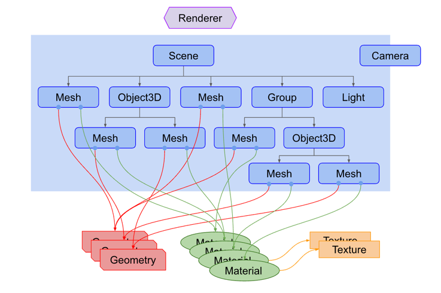
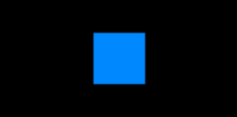
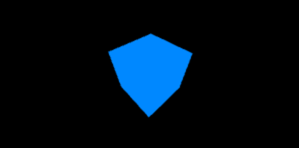
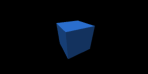
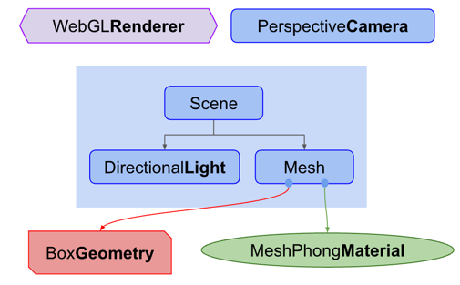

> **导读：**
> 
> 我们想快速创建一个简单的three.js应用，并理解里面的核心概念。
> 
> 请注意：文章从开始学习的角度带入，可能会存在后期深入过程中理解不一致的问题。如果出入不一致的情况，我会以脚注的方式额外修订解释。

## 导包
快速开始的关键步骤
```js
<script src="https://cdn.jsdelivr.net/npm/three@0.132.2/build/three.min.js"></script>
```

## 结构概览
一个基础的three.js应用结构，取自 https://threejs.org/manual/#zh/fundamentals



解释：

**1. 物体：** 在 three.js 中包含很多物体，例如 Mesh、Object3D、Group、Light等，这些物体是可以添加到场景（Scene）中展示的。

**2. 场景：** 所以，场景（Scene）是能够让你在什么地方、摆放什么东西来交给three.js来渲染，这是你放置物体、灯光和摄像机的地方。

**3. 渲染器：** 渲染器（Renderer）是three.js用来渲染场景的，它通常需要一个场景（Scene）和一个摄像机（Camera）。

所以在文档 https://threejs.org/docs/ 中，可以发现，列表分类中会出现几个大类，其中就有：物体、场景和渲染器。

## Example
以渲染一个基础的立方体的例子来说，我们需要定义一个 Mesh，而 Mesh 通常需要一个 几何体（Geometry）以及材质（Material）。

### 1. 定义四边形原始几何类

参考：https://threejs.org/docs/#api/zh/geometries/BoxGeometry
```
BoxGeometry(
    width : Float, 
    height : Float, 
    depth : Float, 
    widthSegments : Integer, 
    heightSegments : Integer, 
    depthSegments : Integer)
```
* width — X 轴上面的宽度，默认值为 1。
* height — Y 轴上面的高度，默认值为 1。
* depth — Z 轴上面的深度，默认值为 1。
* widthSegments — （可选）宽度的分段数，默认值是 1。
* heightSegments — （可选）高度的分段数，默认值是 1。
* depthSegments — （可选）深度的分段数，默认值是 1。

解释：分段数据我的理解，是指将几何体进行分割，比如将几何体进行分割成多个小方块，然后进行渲染，分段数越多，渲染效果越好，越精致。

```js
// 定义了一个长宽高为1的立方体
const geometry = new THREE.BoxGeometry( 1, 1, 1 );
```

### 2. 定义立方体的材质

基础材质 MeshBasicMaterial，参考：https://threejs.org/docs/#api/zh/materials/MeshBasicMaterial

* 材质的颜色(Color)，默认值为白色 (0xffffff)。
```js
const material = new THREE.MeshBasicMaterial( { color: 0x3388ff } );
```

### 3. 使用Mesh定义具体的物体
传入上面创建的几何体和材质，创建一个 Mesh
```js
// Mesh( geometry : BufferGeometry, material : Material )
const mesh = new THREE.Mesh(geometry, material);
```

### 4. 创建场景，并在场景中添加物体
创建场景，并将物体（mesh）添加到场景中
```js
const scene = new THREE.Scene();
scene.add( mesh );
```

### 5. 创建相机，设置相机的位置
使用投影透视模式的相机（PerspectiveCamera）来模拟人眼所看到的景象，它是3D场景的渲染中使用得最普遍的投影模式。

这里的属性，将有一篇专门的相机文档来讲解。这里主要强调一下 `aspect`的设置，这个属性是摄像机视锥体的长宽比，该值默认为 canvas 的宽高比，https://developer.mozilla.org/zh-CN/docs/Web/API/Canvas_API/Tutorial ，文档可知 canvas 默认大小为 300 像素 ×150 像素（宽 × 高，像素的单位是 px），所以 `aspect` 设置为 2
```js
// 创建一个透视摄像机(PerspectiveCamera)
const fov = 75;
const aspect = 2;
const near = 0.1;
const far = 5;
const camera = new THREE.PerspectiveCamera(fov, aspect, near, far);

// 设置相机的初始位置
camera.position.z = 2;
```
### 6. 创建渲染器
WebGL Render 用WebGL渲染出你精心制作的场景。

通常 WebGL Render 渲染器需要一个 canvas 作为渲染目标，这样可以使渲染的位置更可控，所以 `canvas` 是 html 中定义的元素，长这样：
```html
<canvas id="c"></canvas>
```
```js
// querySelector() 方法返回文档中匹配指定 CSS 选择器的一个元素。
const canvas = document.querySelector('#c');
```
定
```js
const renderer = new THREE.WebGLRenderer({antialias: true, canvas});
```

---

到此为止，可以在浏览器中观察到如下效果：



由于摄像机的视角在z轴的正方形（2）这个位置，所以只能看到立方体朝向z轴正方向的一面，我们需要观察到一个动态的立方体，需要用到`requestAnimationFrame`这个函数。它对回调函数的调用频率通常与显示器的刷新率相匹配，比较适合用来创建动画效果

参考：https://developer.mozilla.org/zh-CN/docs/Web/API/Window/requestAnimationFrame

定义一个`render`回掉函数使`cube`围绕着 `x` 和 `y` 轴旋转，并且让渲染器重新渲染
```js
function render(time) {
    time *= 0.001;
    cube.rotation.x = time
    cube.rotation.y = time
    renderer.render(scene, camera)
    // 持续执行动画这个动作
    requestAnimationFrame(render);
}
// 初始的时候使用requestAnimationFrame执行该动画
requestAnimationFrame(render)
```
好的，现在你会在页面中看到一个旋转的立方体：



---

最后我们在场景里增加一个灯光，并修改一下立方体的材质，使其可以反射灯光的效果

定义一个类似太阳的灯光：平行光
参考：https://threejs.org/docs/#api/zh/lights/DirectionalLight

```js
// 从上方照射的白色平行光，强度为 1。
const directionalLight = new THREE.DirectionalLight( 0xffffff, 1 );
// 灯光放的位置，对应x,y,z坐标，这个位置可表示在相机的左后方
light.position.set(-1, 2, 4);
scene.add( directionalLight );
```

修改材质，使用Phong网格材质
参考：https://threejs.org/docs/#api/zh/materials/MeshPhongMaterial

```js
// const material = new THREE.MeshBasicMaterial({color:0x0088ff})

const material = new THREE.MeshPhongMaterial({color:0x3388ff})
```

🎉恭喜，现在你能看到一个旋转的立方体，并且有灯光照射立体感更强。



最后再回顾当前整体结构：



我们定义了一个物体（Mesh），使用了立方体以及可反射性的材质，添加了一个平行光增加立体感，物体和灯光都放进了场景中。

定义了一个透视相机，最后将相机和场景都放进了渲染器中渲染。