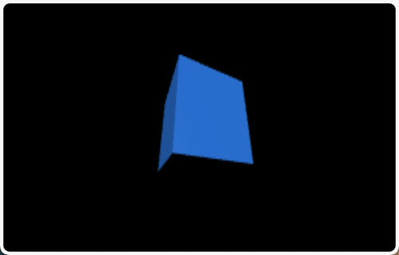
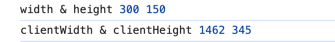
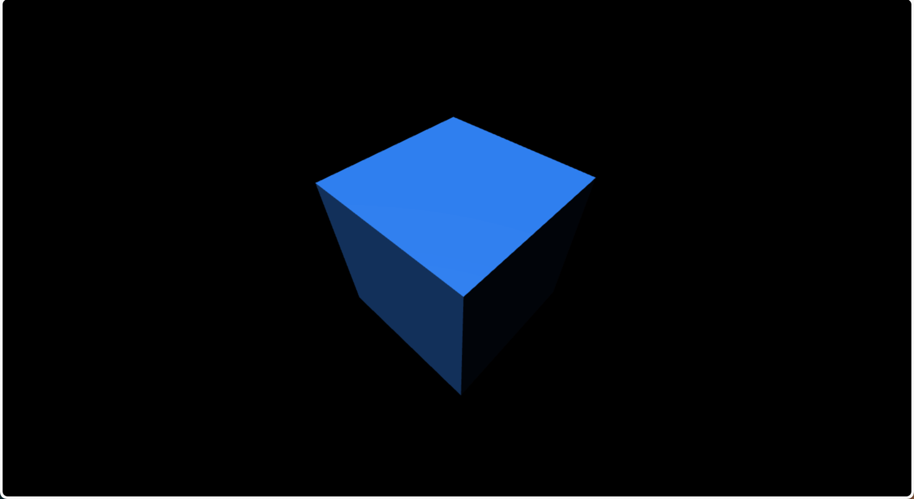
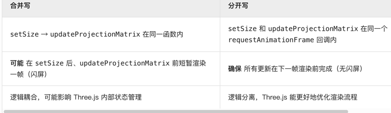

> **导读：**
>
> 在 1-quickstart 中，使用了一个官方介绍的例子快速的理解 Three.js 中的一些概念，刚好我有一个疑惑就是这个案例的效果也太小了。
> 
> 如何更改它的尺寸，并且让其在不同尺寸中也渲染的恰到好处呢？这也就是本文需要介绍的内容。

在 quickstart 中，我们定义了一个 canvas 元素作为渲染的目标
```html
<canvas id="c"></canvas>
```
canvas 元素的默认尺寸是 300 x 150，使用 css 修改其属性，让其占满整个屏幕
```css
body{
    margin: 0;
    padding: 0;
}

#c{
    width: 100vw;
    height: 100vh;
}
```
将之前写的 `js` 复制一下，观察效果如下，能看出来会比较模糊：


而且随着页面的调整，渲染的图像会被拉伸或者压扁。



**1. 解决变形问题**

定义：形变的问题是由于窗口（canvas）的大小被改变，所以导致渲染的图像被拉伸或者压扁的现象。

原因：之前我们设置摄像机的属性时，有一个属性是 `aspect`，当时我们设置的如下：
```
const aspect = 2;
```
这是因为我们未设置 canvas 宽高，由于其默认宽高为 300x150，所以 `aspect` （宽高比）的值为 2。

现在我们修改了 canvas 的宽高，所以要保证观察到图像具有正确的宽高比，所以 `aspect` 的值应该为 `canvas.width / canvas.height`。

明白了问题的原因，思考**如何解决它**。之前在渲染的时候，通过 `requestAnimationFrame` 在回调函数中根据浏览器的刷新频率实现动画效果。

同样也可以实现画布大小变动时，动态的设置摄像机的`aspect`属性，就可以正常渲染物体了。主要有三个内容：


* `renderer.domElement`，可以获取到对应输出的canvas元素

* 获取元素实际的宽高，clientWidth 参考 https://developer.mozilla.org/zh-CN/docs/Web/API/Element/clientWidth ，它与clientHeight都是为了获取实际的宽高

* 相机的大多数属性发生改变之后，需要调用.updateProjectionMatrix来使得这些改变生效

修改的代码如下：
```js
function render(time){
    // 原先的代码 ...
    const canvas = renderer.domElement;
    camera.aspect = canvas.clientWidth / canvas.clientHeight;
    camera.updateProjectionMatrix();
}
```

再次改变画布大小时，发现渲染的内容不再被拉伸变形了。


**2. 解决渲染质量问题**

思考：图像为什么会出现马赛克状？我用拍摄照片的角度去回答这个问题，假设我用一个手机拍摄了一张照片，其分辨率是 1920 x 1080，我的手机分辨率同样是 1920 x 1080，那么这张照片会显示的比较清楚。但是将这个照片放到电脑上（分辨率：2560 x 1600），这张照片在电脑上全屏就会变得模糊。

带入：Three.js 的渲染器（如 WebGLRenderer）默认使用 canvas 的像素尺寸（即画布本身的 width/height 属性，而非 CSS 尺寸）。可以通过 `console`打印输出：



[“一个canvas的内部尺寸，它的分辨率，通常被叫做绘图缓冲区(drawingbuffer)尺寸。 在three.js中我们可以通过调用renderer.setSize来设置canvas的绘图缓冲区。 我们应该选择什么尺寸? 最显而易见的是"和canvas的显示尺寸一样"。 即可以直接用canvas的clientWidth和clientHeight属性。”](https://threejs.org/manual/#zh/responsive)

判断方式就是，判断 canvas 的 width , height 分别与 clientWidth , clientHeight 进行等值判断。如果不相等的话，使用 `renderer.setSize`重新设置。

```js
function render(time){
    // 原先的代码 ...
    const canvas = renderer.domElement;
    const needResize = canvas.width !== canvas.clientWidth || canvas.height !== canvas.clientHeight;
    if(needResize){
        renderer.setSize(canvas.clientWidth, canvas.clientHeight, false); //  false是：不同步修改CSS
    }
}
```

终于你得到一个巨清晰的立方体！并且是响应式的。


---

现在我们重新整理一下代码，做一个逻辑判断，职责清晰：
```js
// 1. 只调整 Canvas 尺寸
function resizeRendererToDisplaySize(renderer) {
    const canvas = renderer.domElement;
    const width = canvas.clientWidth
    const height = canvas.clientHeight
    const needResize = canvas.width !== width || canvas.height !== height;
    if (needResize) {
        renderer.setSize(width, height, false);
    }
    return needResize; // 返回是否调整过
}

// 2. 在渲染循环里按需更新相机
function render(time) {
    if (resizeRendererToDisplaySize(renderer)) {
        camera.aspect = renderer.domElement.clientWidth / renderer.domElement.clientHeight;
        camera.updateProjectionMatrix();
  }
    renderer.render(scene, camera);
}
```
> 这样做还有一个好处是避免闪屏的出现，我用大模型解释了一下，大家可以自己尝试一下：
> 
---
最后还有一个问题像素单位，通常情况下屏幕的像素单位是 1，但是在HD-DPI显示器中可能是3或者其它数字，这是为了得到更好的分辨率，所以最好在渲染之前乘以这个数字，这样才能调节到最好的分辨率。 https://developer.mozilla.org/zh-CN/docs/Web/API/Window/devicePixelRatio

```js
function resizeRendererToDisplaySize(renderer) {
    const canvas = renderer.domElement;
    const pixelRatio = window.devicePixelRatio; // 增加这个
    const width = Math.floor(canvas.clientWidth * pixelRatio);
    const height = Math.floor(canvas.clientHeight * pixelRatio);
    const needResize = canvas.width !== width || canvas.height !== height;
    if (needResize) {
        renderer.setSize(width, height, false);
    }
    return needResize; // 返回是否调整过
}
```